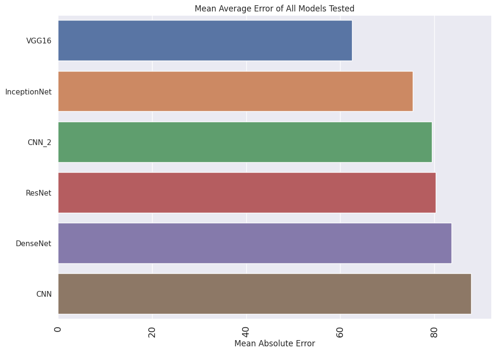

## CNN Project
This repository contains code and resources for a Convolutional Neural Network (CNN) project. The CNN is implemented using Tensorflow, and it is trained on a [Dataset]( https://www.kaggle.com/datasets/paultimothymooney/chest-xray-pneumonia) from kaggle. The model is generally designed to classify different images of different patients whether he or she has pneumonia or not.(Normal or Pneumonia Images)  

## What is Pneumonia ?
From Mayo Clinic's Article on pneumonia

Pneumonia is an infection that inflames the air sacs in one or both lungs. The air sacs may fill with fluid or pus (purulent material), causing cough with phlegm or pus, fever, chills, and difficulty breathing. A variety of organisms, including bacteria, viruses and fungi, can cause pneumonia.

Pneumonia can range in seriousness from mild to life-threatening. It is most serious for infants and young children, people older than age 65, and people with health problems or weakened immune systems.

## Dataset
Here we are **importing data directly from kaggle**, since it is a large dataset. Go to Kaggle and generate an api token. A .json file will downloaded. Upload it when you run the second cell. A prompt will be asked to upload a file when the code is run. 

[DataSet](https://www.kaggle.com/datasets/paultimothymooney/chest-xray-pneumonia)

The dataset is organized into 3 folders (train, test, val) and contains subfolders for each image category (Pneumonia/Normal). There are 5,863 X-Ray images (JPEG) and 2 categories (Pneumonia/Normal).

Chest X-ray images (anterior-posterior) were selected from retrospective cohorts of pediatric patients of one to five years old from Guangzhou Women and Children’s Medical Center, Guangzhou. All chest X-ray imaging was performed as part of patients’ routine clinical care. For the analysis of chest x-ray images, all chest radiographs were initially screened for quality control by removing all low quality or unreadable scans. The diagnoses for the images were then graded by two expert physicians before being cleared for training the AI system. In order to account for any grading errors, the evaluation set was also checked by a third expert.

## Transfer Learning
Transfer learning involves using a pre-trained model on a new but similar task. The pre-trained model has already learned features from a large dataset and can be fine-tuned or adapted to a different task with a smaller dataset.

Here we have used CNN architectures such as:
- DenseNet
- VGG 16
- ResNet
- InceptionNet

All these architectures are used on this large image datasets to **fine-tune** the models.

## Results
The accuracy on different models are as follows:

## Platform
Since my machine do not have a GPU support , I have used **Google Colab** as a platfom to do this project and used the free **T4 GPU** runtime. 

